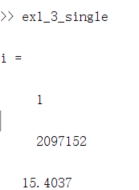

# 第一章 数值计算导论

## 1.1

### 解题思路

首先设定步长在$10^{-16} - 1$之间。

然后列出每一种误差的计算式，计算式如下：

+ 截断误差限：$ \frac{h*M}{2} $，其中M取1
+ 舍入误差限：$ \frac{epsilon*2}{h} $,其中epsilon取$10^{-16}​$
+ 总误差限为以上两个误差之和
+ 实际误差为近似式与实际计算式之差：$ | \frac{sin(1+h)-sin(1)}{h} - cos(1) | ​$

### 实验结果

代码如下：

````matlab
h = 10.^(-16:0.2:0);
epsilon_limit = h./2 + 10^(-16)*2./h;
epsilon_real = abs((sin(1+h)+-sin(1))./h-cos(1));
epsilon_trunc = h./2;
epsilon_round = 10^(-16)*2./h;
loglog(h,epsilon_limit,h,epsilon_real,h,epsilon_trunc,h,epsilon_round);
axis([10.^-16,10.^0,0,2])
````

结果图像：


### 实验结论

对于给定的问题，有时候截断误差占主导，有时候舍入误差占主导，我们应概通过合理的实验来决定如何选取实验参数来使二者之和最小。


## 1.3

### 解题思路

求和结果不再发生变化说明发生了大数吃掉小数现象。即：

$ \frac{\frac{1}{n+1}}{\sum_1^n\frac{1}{i}} \le \frac{1}{2}*epsilon_{march} $

对于双精度浮点数而言，$epsilon_{march} = 2^{1-53} \approx 1.11*10^{-15} $,且$\lim_{n\rightarrow+\infty}\sum_1^n{\frac{1}{n}} \rightarrow ln(n)+0.57722$

所以不等式可改为$ \frac{1}{(n+1)(ln(n)+0.57722)} \le 0.5*1.11*10^{-15}$ 解不等式可知，$n  \approx 10^{14}$时，会发生大数吃掉小数现象。

在(1)实验中可知，2097153项的计算需要0.269s，所以只需要可列出方程$\frac{t}{0.269}=\frac{10^{14}}{2097153}​$,得t = 12922281s,约需要150天计算完毕。

对于单精度浮点数而言，同双精度浮点数计算过程，易计算得$n \approx 2*10^{6}​$

### 实验结果

单精度计算代码如下：

````matlab
a = single(0);
answer = single(1);
i = 1
while answer - a > 0
    i = i+1;
    a = answer;
    answer = answer + single(1./i);
end
disp(i)
disp(answer)
````

运行输出：




运行时间


双精度计算只需要去掉`single`限定即可。

````matlab
a = 0;
answer = 1;
i = 1
while answer - a > 0
    i = i+1;
    a = answer;
    answer = answer + 1./i;
    if i == 2097152
        disp(answer)
    end
end
disp(i)
````

运行结果：


### 结论

通过实验可知，单精度计算时，在与n=2097152项相加时，会发生大数吃掉小数现象,与估计结果相近，运算结果为15.4037,双精度情况下，运行到该项时结果为15.1333，以15.1333为标准，则单精度计算结果绝对误差为0.2704，相对误差为1.79%。当前计算条件下，双精度计算需要非常长的时间来计算。

