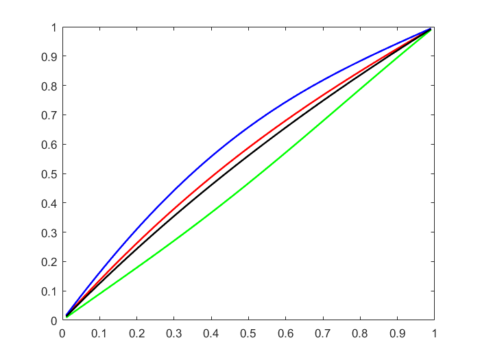
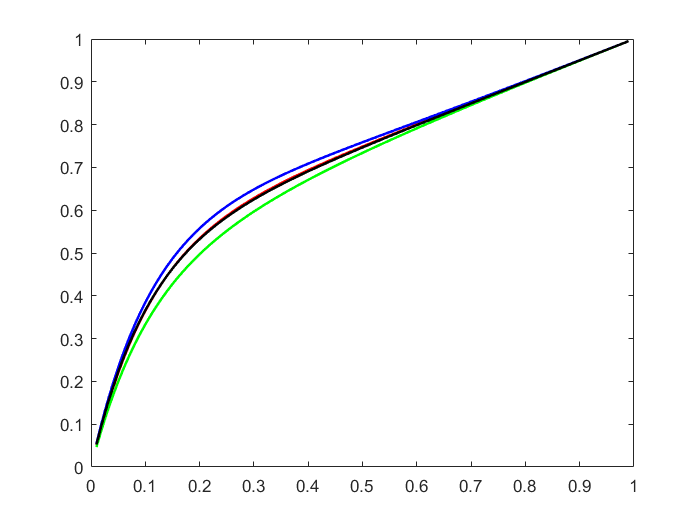
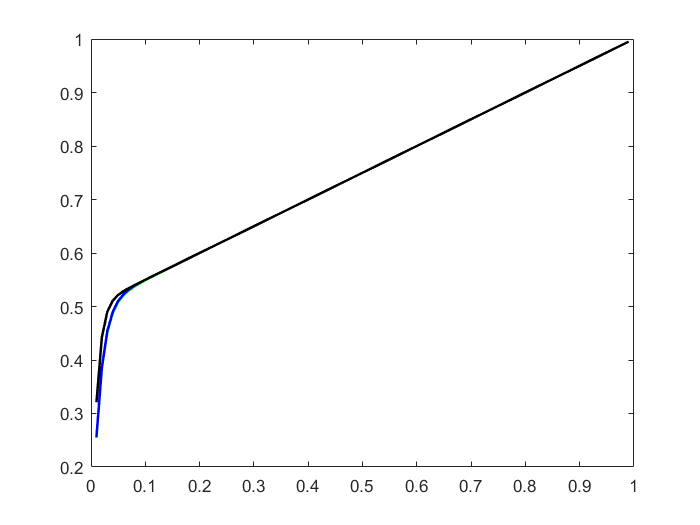
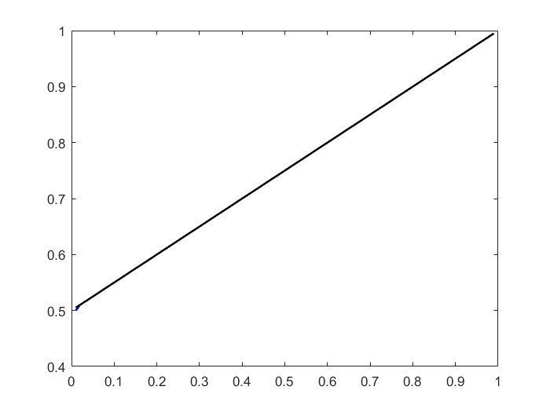

# 第四章 线性方程的迭代解法

## 4.2

### 解题思路

+ 按照精确解公式直接求出精确解
+ 构造矩阵A、向量b
+ 按照书上算法直接使用G-S、jacobi和SOR求解
+ 修改epsilon，作图、求误差进行比较

##### `main.m`

功能：入口，构造矩阵、向量，求精确解，调用各求解函数并作图、求误差

````matlab
epsilon = 1;
a = 0.5;
n = 100;
h = 1/n;
A = zeros(n-1,n-1);
%build A
for i=1:n-1
    for j=1:n-1
        if i == j
            A(i,j) = -2*epsilon - h;
        end
        if j == i + 1
            A(i,j) = epsilon + h;
        end
        if j == i - 1
            A(i,j) = epsilon;
        end
    end    
end

%build b
b = zeros(n-1,1);
b(1:n-1) = a*h*h;
b(n-1) = a*h*h-epsilon-h;

x = 0:1/n:1;
%true ans
true_y = (1-a)*(1-exp(-x/epsilon))/(1-exp(-1/epsilon))+a*x;

%GS
GS_ans = GS(A,b,n-1);
%jacobi
jacobi_ans = jacobi(A,b,n-1);
%SOR
sor_ans = SOR(A,b,n-1);

figure;
plot(x(2:n),sor_ans,'r',x(2:n),jacobi_ans,'g',x(2:n),GS_ans,'b',x(2:n),true_y(2:n),'k','LineWidth',1.5);
GS_delta = calculate_delta(GS_ans,true_y(2:n),n-1)
jacobi_delta = calculate_delta(jacobi_ans,true_y(2:n),n-1)
sor_delta = calculate_delta(sor_ans,true_y(2:n),n-1)
````

##### `jacobi.m`

功能：使用jacobi迭代法求解线性方程组。

````matlab
function x = jacobi(A,b,n)
    x = zeros(n,1);
    y = ones(n,1);
    jacobi_cnt = 1;
    while calculate_delta(x,y,n) > 1e-4
        y = x;
        for i=1:n
            x(i) = b(i);
            for j =1:i-1
                x(i) = x(i) - A(i,j)*y(j);
            end
            for j = i+1:n
                x(i) = x(i) - A(i,j)*y(j);
            end
            x(i) = x(i)/A(i,i);
        end
        jacobi_cnt = jacobi_cnt + 1;
    end
    jacobi_cnt
end
````

##### `GS.m`

功能：使用G-S迭代法求解线性方程组。

````matlab
function [x]=GS(A,b,n)
x = ones(n,1);
x_2 = zeros(n,1);
GS_cnt = 1;
while calculate_delta(x,x_2,n) > 1e-4
    x_2 = x;
    for i=1:n
        x(i) = b(i);
        for j =1:i-1
            x(i) = x(i) - A(i,j)*x(j);
        end
        for j = i+1:n
            x(i) = x(i) - A(i,j)*x(j);
        end
        x(i) = x(i)/A(i,i);
    end
    GS_cnt = GS_cnt + 1;
end
GS_cnt
end
````

##### `SOR.m`

功能：使用sor方法求解线性方程组。

````matlab
function [x]=SOR(A,b,n)
w = 1.56;
x = ones(n,1);
x_2 = zeros(n,1);
sor_cnt = 0;
while calculate_delta(x,x_2,n) > 1e-4
    x_2 = x;
    for i=1:n
        x(i) = b(i);
        for j =1:i-1
            x(i) = x(i) - A(i,j)*x(j);
        end
        for j = i+1:n
            x(i) = x(i) - A(i,j)*x(j);
        end
        x(i) = x(i)/A(i,i);
        x(i) = (1-w)*x_2(i) + w*x(i);
    end
    sor_cnt = sor_cnt + 1;
end
sor_cnt
end
````

##### `calculat_delta.m`

功能：计算误差。计算两个向量之差的无穷范数。

````matlab
function [delta] = calculate_delta(x,y,n)
    max = 0;
    for i = 1:n
        if max < abs(x(i)-y(i))
            max = abs(x(i)-y(i));
        end    
    end
    delta = max;
end
````


### 实验结果

##### epsilon = 1

实验参数：a = 0.5,n=100，w=1.56

> 黑色线为精确计算结果，红色线为SOR计算结果，绿色线为jacobi计算结果，蓝色线为G-S计算结果。



|                    | jacobi | G-S    | SOR    |
| ------------------ | ------ | ------ | ------ |
| 误差(差的无穷范数) | 0.0951 | 0.0981 | 0.0274 |
| 迭代次数           | 4068   | 1691   | 815    |

##### epsilon = 0.1

实验参数：a = 0.5,n=100，w=1.56

> 黑色线为精确计算结果，红色线为SOR计算结果，绿色线为jacobi计算结果，蓝色线为G-S计算结果。



|                    | jacobi | G-S    | SOR    |
| ------------------ | ------ | ------ | ------ |
| 误差(差的无穷范数) | 0.0362 | 0.0254 | 0.0031 |
| 迭代次数           | 3077   | 1000   | 414    |

##### epsilon = 0.01

实验参数：a = 0.5,n=100，w=1.56

> 黑色线为精确计算结果，红色线为SOR计算结果，绿色线为jacobi计算结果，蓝色线为G-S计算结果。



|                    | jacobi | G-S    | SOR    |
| ------------------ | ------ | ------ | ------ |
| 误差(差的无穷范数) | 0.0668 | 0.0652 | 0.0660 |
| 迭代次数           | 467    | 238    | 112    |

##### epsilon = 0.0001

实验参数：a = 0.5,n=100，w=0.5

> 黑色线为精确计算结果，红色线为SOR计算结果，绿色线为jacobi计算结果，蓝色线为G-S计算结果。



|                    | jacobi | G-S    | SOR    |
| ------------------ | ------ | ------ | ------ |
| 误差(差的无穷范数) | 0.0051 | 0.0049 | 0.0043 |
| 迭代次数           | 113    | 104    | 228    |

### 实验总结

在该问题求解中，epsilon越小，各解法求解的误差越小，迭代次数也相应减少，但是在epsilon=0.0001时，SOR方法不收敛。

对于同样的epsilon而言，若SOR方法选取了合适的松弛变量，则四种方法误差相差不大，但是迭代步数满足：SOR<G-S<jacobi，若选取了不合适的w，SOR方法收敛次数可能会增大以至于超过其他两种方法，甚至不收敛。